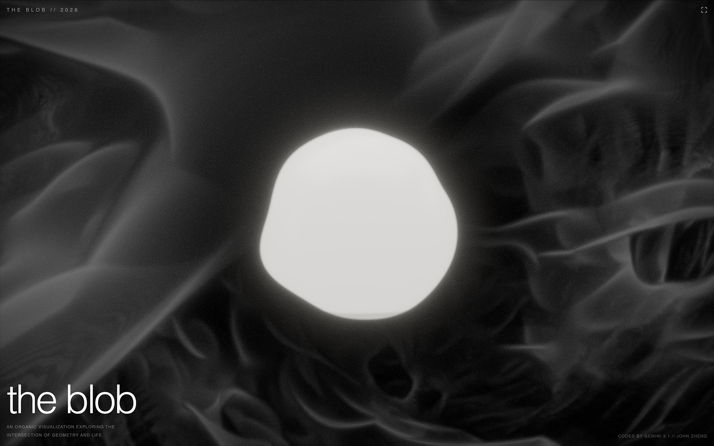

An organic WebGL visualization exploring the intersection of geometry and life.

## Tech Stack

- **Next.js 16** (App Router) + **React 19** + **TypeScript 5**
- **Three.js** via **@react-three/fiber**, **@react-three/drei**, **@react-three/postprocessing**
- **Tailwind CSS v4**
- Custom **GLSL** raymarched tunnel background
- **Gyroscope parallax** (iOS springboard-style)
- **AGX tone mapping**, depth of field, bloom, vignette post-processing
- Product photography lighting with custom environment lightformers
- PWA-ready with fullscreen support

## Getting Started

```bash
npm install
npm run dev
```

Open [http://localhost:3000](http://localhost:3000)

## Build

```bash
npm run build
npm start
```

## Credits

Coded by Gemini 3.1 // John Zheng
